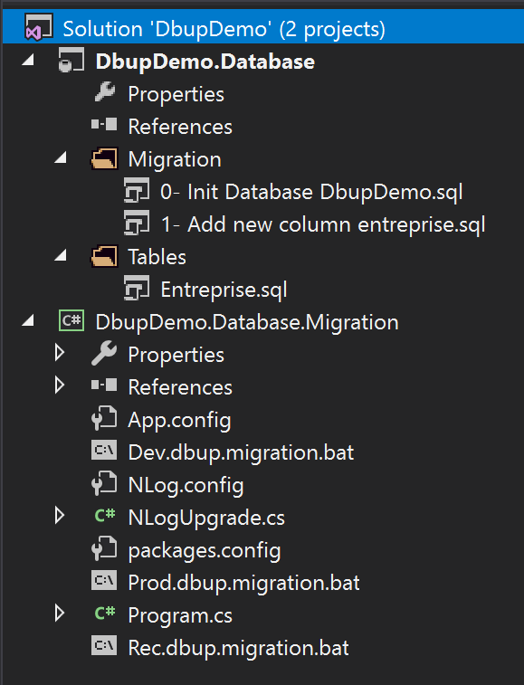

# Comment versionner une base de données ?
Commençons par le début, notre premier sprint. Il se passe bien, notre socle est prêt, notre premier écran est là avec une première table. **Tout va bien🙂 !**

Pour la base de données, nous avons créé **un Database Project**, le script de création de notre unique table est dedans, il est donc versionné avec le code source de l’application.

Jusqu’à maintenant, nous travaillons dans un seul environnement de dev, mais bientôt nous déploierons en recette puis en pré-prod et enfin en production, bientôt il y aura d’autres sprints et la structure de la base changera forcement.

Avec plusieurs environnements et chacun avec son propre état (des données de références, une colonne en plus, une table en moins, …) plusieurs questions se posent : **Comment connaitre l’état de la base ? Comment faire passer la base d’un environnement particulier vers un autre état ?**

Vous allez me dire que à coup de “compare”, de scripts passés manuellement, le tout logué dans un fichier Excel (ou dans la tête de quelqu’un) on va surement s’en sortir.

**On peut mieux faire, avec les bons outils !**

# Gérer le déploiement des transformations
Chaque itération ramènera son lot de changement, un compare n’est pas toujours suffisant face à des scénarios complexes de modification de tables ou de colonnes existantes.

Il nous faut un outil qui nous permettra de gérer correctement cette transformation, qui permettra d’appliquer la modification, de la loguer et de restituer la bonne “version” de la base données.

**J’ai choisi de vous parler de DbUp, une librairie .Net conçue pour ça.**

# Comment ?
Dans une solution Visual studio :
1. Créez un projet **« Database Project »** et ajoutez dedans un dossier **« Migration »** ou on mettra les scripts de transformation.
2. Créez un projet **« Console »**, installez **le package Nuget DbUp** :
```
      Install-Package DbUp 
```
3. Mettez dans les propriétés du projet, en **« Post-build  event commande line »**, les commandes pour copier le contenu du dossier **« Migration »** du Database project vers le dossier script de notre projet **« Console »**: 
```
rmdir "$(TargetDir)\scripts\" /Q
xcopy "$(SolutionDir)\DbupDemo.Database\Migration" "$(TargetDir)\scripts\" /Y /I
```
4. Créez un **« .bat »** par environnement cible, qui lancera l’exécutable avec les paramètres appropriés,  ci-dessous un exemple :
```
"DbupDemo.Database.Migration.exe" -cs "Data Source=(localdb)\MSSQLLocalDB;Initial Catalog=DbUpDemo;Integrated Security=True;Encrypt=False;TrustServerCertificate=False;ApplicationIntent=ReadWrite;MultiSubnetFailover=False" -d "scripts" -e
```


## Tout se passe dans le Main
Dans **le Main du Program.cs**, il y aura la prise en compte des paramètres, l’appel à **« DbUp.DeployChanges »**, ci-dessus un exemple : 
``` csharp
static void Main(string[] args)
{
        
 var directory = ""; 
 bool mark = false;
 bool prompt = false;
 var connectionString = "";
 bool ensure_database = false;

 var optionSet = new OptionSet() {
     { "d|directory=", "directory containing SQL Update files", dir => directory = dir },
     { "e|ensure", "ensure datbase exists", e => ensure_database = e != null },     
     { "cs|connectionString=", "Full connection string", cs => connectionString = cs},
     { "prompt", "Prompt user when finish", p => prompt = true},
 };

 optionSet.Parse(args);

 var dbup = DeployChanges.To
     .SqlDatabase(connectionString)
     .LogScriptOutput()
     .LogToConsole()
     .WithScriptsFromFileSystem(directory)     
     .Build();

 DatabaseUpgradeResult result = null;

 if (!result.Successful)
 {
     Environment.ExitCode = 1;
 }

 if (prompt)
 {
     Console.Write("Press a key to quit");
     Console.ReadKey();
 }
}
```

## Références 
• Vous trouverez ici [La doc DbUp](https://dbup.readthedocs.io/en/latest/).

> Amusez-vous bien 🙂 ! 


